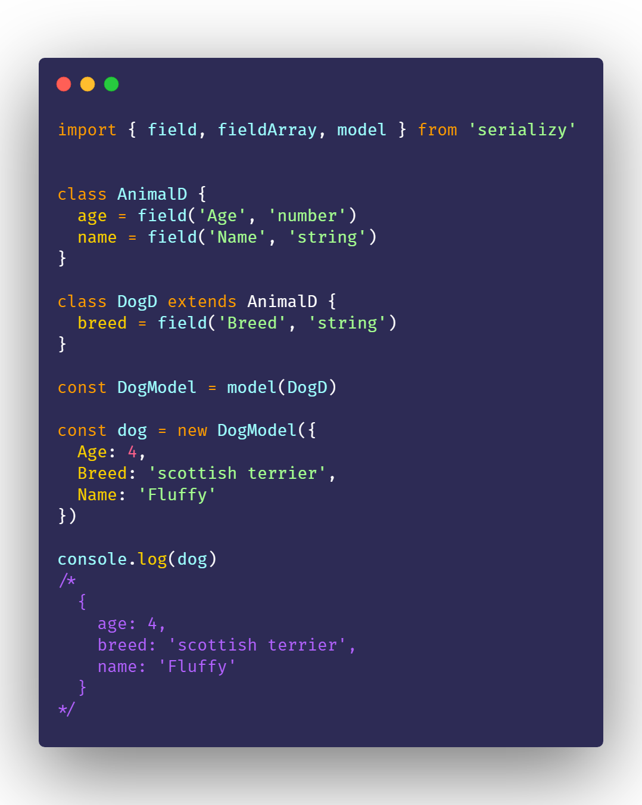

<div align="center">

  [](https://www.npmjs.com/package/serializy) 

  [](./LICENSE)
  [](https://www.npmjs.com/package/serializy)
  [](https://www.jsdelivr.com/package/npm/serializy)
  [](https://travis-ci.org/acacode/serializy)
  [](http://npm-stat.com/charts.html?package=serializy)
  [](https://bundlephobia.com/result?p=serializy)
  [](https://bundlephobia.com/result?p=serializy)
  [](https://packagephobia.now.sh/result?p=serializy)

  <p>
    Object schema validation and data serialization
  </p>
</div>

## ❓ What is that ?

This thing allows you to don't have to worry about changing server-side structures!  
  
Sometimes when server change JSON structures or frontend start using different API  
These situations can make some problems in frontend applications  
Because mostly use the same structure from server when develop user interfaces  
  
But with **serializy** you can describe structure which you will use and which server wants to see  

Sounds interesting, yeah ? :-)  
Scroll down and take a look at the examples ;-)


## 💡 How to use

Nothing to hard, just create a class or simple object which will contain all your structure declarations (using `field()`, `fieldArray()`).  
And send this class/object to the `model()` function as argument  
Like in example:  

```js
import { field, fieldArray, model } from 'serializy'

class DeveloperDeclaration {
  likeCoffee = field('LIKE_COFFEE', 'boolean')
  languages = fieldArray('LaNgUagEs', 'string')
}
```
Creating declaration using class is not important, you can create just a simple object:  
```js

const DeveloperDeclaration = {
  likeCoffee: field('LIKE_COFFEE', 'boolean'),
  languages: fieldArray('LaNgUagEs', 'string'),
}

```
  
```js
const DeveloperModel = model(DeveloperDeclaration)
```

And when you get server structure just create instance of your declared model:  

```js

const ServerStructure = {
  LIKE_COFFEE: true,
  LaNgUagEs: ['GoLang', 'Python']
}

const developer = new DeveloperModel(ServerStructure)

console.log(developer.likeCoffee) // will be true :-)
```

But what if you need to change your client model and send it to the server ?  
You can use `.deserialize()` of each created instance of declared model:  

```js

developer.likeCoffee = false
developer.languages.push('JavaScript')

developer.deserialize()
/*
{
  LIKE_COFFEE: false,
  LaNgUagEs: ['GoLang', 'Python', 'JavaScript']
}
*/
```
Also your created structure declaration (like `DeveloperModel`) have methods:  
- `.serialize(serverModel)` - to convert server-side structure to client-side  
- `.deserialize(clientModel)` - to convert client-side structure to server-side  
  
## 📚 Documentation
Serializy have exports: `field()`, `fieldArray()`, `model()`  

<hr>

### 🔹 `field(...options: FieldOptions)`[[Source]](./src/field_declaration.ts#L102)  

This function is needed for describing property in the original structure.  
  

Options:  

- ◼️ `field(originalPropertyName: string, originalType?: string, usageType?: string)`  

`originalType` and `usageType` should be one of the [following strings](./src/converter.ts#L30) ('boolean', 'number', 'string', 'object', 'any'):  

Examples:  
```js

const Model = model({
  someProp: field({
    name: 'SomeProp',
    optional: true,
    type: 'number',
    usageType: 'string'
  })
})

const structure = new Model({
  SomeProp: 12345
})

console.log(structure.someProp) // '12345' because usageType - 'string'
console.log(structure.deserialize()) // { SomeProp: 12345 }
```  
  


  
  
  
- ◼️ `field(originalPropertyName: string, modelDeclaration: ModelDeclaration)`  

  This type of the field declaration allows you to transform complex structures to usage structures    
  Arguments:  
      - ◾️ `originalPropertyName: string` - name of the property in original structure.  Original property with this name will be assigned to usage property.  
      - ◾️ `modelDeclaration: ModelDeclaration` - model declaration needed for convert original object into usage object.  
          [`modelDeclaration`](./src/field_declaration.ts#L8) should be `object`/`model(DeclarationsClass)`  
          And keys/properties should have values created via `field()`, `fieldArray()` function  


Examples:  
```js
const FooModel = model(class FooModel {
  foo = field('Foo', 'number', 'string')
})

class Model = model({class Model {
  fooStruct = field('FooStruct', FooModel)
}})
```  
```js
class Model = model({class Model {
  fooStruct = field('FooStruct', {
    foo = field('Foo', 'number', 'string')
  })
}})

const fooBarStruct = new Model({
  FooStruct: { Foo: 12345 }
})

console.log(fooBarStruct) // { fooStruct: { foo: '12345' } }
console.log(fooBarStruct.deserialize()) // { FooStruct: { Foo: 12345 } }
```  
  


  
  

  
- ◼️ `field(customSerializer: function, customDeserializer?: function)`  

  You can attach custom serializer/deserializer for specific cases.  
  Arguments:  
      - ◾️ `customSerializer: function` - this function should return value of the usage property. Takes one argument - original structure   
      - ◾️ `customDeserializer?: function` - this function should return object which will been merged to the original structure. Takes one argument - usage structure  


Examples:  
```js
const Model = model({
  barBaz: field(
    ({ bar, baz }) => `${bar}/${baz}`,
    ({ barBaz }) => {
      const [bar, baz] = barBaz.split('/')
      return { bar, baz }
    }
  ),
  foo: field(({ foo }) => foo, ({ foo }) => ({ foo })) // in this case just better to use field('foo')
})

const structure = new Model({
  foo: 'foo',
  bar: 'bar',
  baz: 'baz'
})

console.log(structure) // { barBaz: 'bar/baz', foo: 'foo' }
console.log(structure.deserialize()) // { foo: 'foo', bar: 'bar', baz: 'baz' }
```  
  


  
  

  
- ◼️ `field({ name: 'property_name', type: 'original_type', usageType: 'usage_type' }: object)`  

  This is just another way to declare property.   
  Properties:  
      - ◾️ `name: string` - key name in the original structure  
      - ️◾️ `type?: PropertyType` - type of the original property  
      - ◾️ `usageType?: PropertyType`- type for usage property  
      - ◾️ `arrayType?: boolean` - property have array type or not  
      - ◾️ `optional?: boolean` - this property is required or not  


Examples:  
```js
const Model = model({
  someProp: field({
    name: 'SomeProp',
    optional: true,
    type: 'number',
    usageType: 'string'
  })
})

const structure = new Model({
  SomeProp: 12345
})

console.log(structure.someProp) // '12345' because usageType - 'string'
console.log(structure.deserialize()) // { SomeProp: 12345 }
```  
  


<!-- Function `field()` needs you to describe some property of your model like  
```
class  -->

<hr>


### 🔹 `fieldArray()`[[Source]](./src/field_declaration.ts#L105)  

This is the same thing like [`field()`](#fieldsource) but it needs to describe array of data  


Argument variations:  

- ◼️ `fieldArray(originalPropertyName: string, originalType?: string, usageType?: string)`  
`originalPropertyName` - name of property which should be exist in original structure  
`originalType` should be one of the [following strings](./src/converter.ts#L30) ('boolean', 'number', 'string', 'object', 'any')  


- ◼️ `fieldArray(originalPropertyName: string, modelDeclaration: ModelDeclaration)`  
`originalPropertyName` - name of property which should be exist in original structure  
[`modelDeclaration`](./src/field_declaration.ts#L8) should be `object`/`model(DeclarationsClass)`  
And keys/properties should have values created via `field()`, `fieldArray()` function  

<hr>


### 🔹 `model()`[[Source]](./src/model_wrapper.ts#L48)  

This function allows to make model from structure declaration.  

  


   
   
   
## 📄 Examples  

All examples are located [here](./example/index.ts)  





## 📢 Integrations  

  [**kinka-serializy**](https://github.com/acacode/kinka-serializy) - integration serializy with http web-client [**kinka**](https://github.com/acacode/kinka)  
  [**axios-serializy**](https://github.com/acacode/axios-serializy) - integration serializy with http web-client [**axios**](https://github.com/axios/axios)


## 📝 License

Licensed under the [MIT License](./LICENSE).
